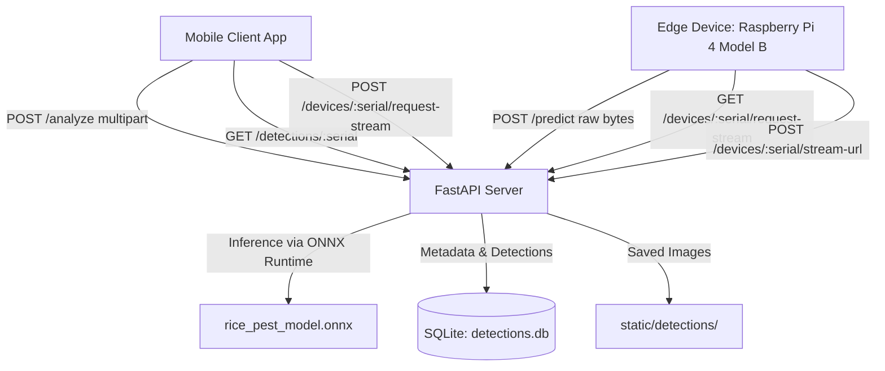

# 🌾 RiceScan: Rice Pest CNN Classifier & Edge IoT Server

[](https://www.python.org/)
[](https://fastapi.tiangolo.com)
[](https://onnxruntime.ai/)
[](LICENSE)

An end-to-end edge-cloud computer vision system for real-time rice pest detection and classification. Designed for agricultural thesis research, low-power edge nodes (Raspberry Pi 4 Model B), and mobile client synchronization.

---

## 📌 Table of Contents
- [System Architecture](#-system-architecture)
- [Supported Pest Classes](#-supported-pest-classes)
- [Machine Learning & Model Pipeline](#-machine-learning--model-pipeline)
- [API Reference](#-api-reference)
  - [Inference & Detection](#inference--detection)
  - [IoT Live Stream & Monitoring](#iot-live-stream--monitoring)
- [Database Schema](#-database-schema)
- [Installation & Local Setup](#-installation--local-setup)
- [Deployment (Render / Cloud)](#-deployment-render--cloud)
- [Model Maintenance & Class Updates](#-model-maintenance--class-updates)
- [Project Directory Structure](#-project-directory-structure)

---

## 🏛️ System Architecture



1. **Edge IoT Node (Raspberry Pi 4 Model B):** Captures crop images periodically and streams/uploads them via HTTP.
2. **Central Cloud Inference Server (FastAPI + ONNX Runtime):** Runs non-blocking forward passes in under ~40–80 ms without requiring heavy PyTorch GPU dependencies in production.
3. **Filtering & Fallback Layer:** Rejects predictions below the confidence threshold (`50%`) and automatically gates non-pest captures using the dedicated `No Pest` class.
4. **Mobile Application:** Pulls verified detections, reviews historical confidence breakdowns, and requests on-demand live video tunnels.

---

## 🌾 Supported Pest Classes

The model classifies inputs into **10 target classes** (9 major rice pests + 1 non-pest negative class):

| Index | Class Name | Folder / Token | Notes |
|:---:|:---|:---|:---|
| **0** | Army Worm | `army_worm` | Leaf & foliage feeder |
| **1** | Brown Plant Hopper | `brown_plant_hopper` | Phloem sap feeder / hopperburn vector |
| **2** | Golden Apple Snail | `golden_apple_snail` | Stem & young seedling pest |
| **3** | **No Pest** | `no_pest` | **Negative fallback** class (foliage, soil, weeds, noise) |
| **4** | Paddy Stem Maggot | `paddy_stem_maggot` | Larval stem and shoot borer |
| **5** | Rice Black Bug | `rice_black_bug` | Sap-sucking tillering/panicle pest |
| **6** | Rice Bugs | `rice_bugs` | Grain-filling stage pest |
| **7** | Rice Leaf Caterpillar | `rice_leaf_caterpillar` | Defoliator |
| **8** | Rice Leaf Hopper | `rice_leaf_hopper` | Green leafhopper / tungro virus vector |
| **9** | Rice Stem Borer | `rice_stem_borer` | Deadheart & whitehead symptom causer |

> ⚠️ **Important:** In `server/main.py`, class indices strictly follow standard PyTorch `ImageFolder` **alphabetical sorting** of dataset folder names.

---

## 🧠 Machine Learning & Model Pipeline

### 1. Model Backbone
- **Architecture:** MobileNetV3 (optimized for edge and mobile workloads).
- **Technique:** Transfer learning with fine-tuned top classification head.
- **Input Tensor Dimensions:** `[1, 3, 224, 224]` (Batch Size, Channels, Height, Width).
- **Normalization (ImageNet Standard):**
  - Mean: `[0.485, 0.456, 0.406]`
  - Standard Deviation: `[0.229, 0.224, 0.225]`

### 2. Training & Augmentation
- Random horizontal & vertical flipping.
- Random affine transformations: rotation ($\pm 25^\circ$), translation, and scaling.
- Photometric jitter: brightness ($0.7 \times - 1.3 \times$) and contrast balance.
- Loss function: Weighted Cross-Entropy to handle class imbalance across minority field samples.
- Optimizer: Adam with `StepLR` decay.

### 3. Production ONNX Export
Exported to `rice_pest_model.onnx` with dynamic batch axis:
```text
Input:  float32[batch_size, 3, 224, 224]
Output: float32[batch_size, 10]
```
Running via ONNX Runtime eliminates PyTorch and CUDA runtime dependencies, minimizing cloud memory footprint (< 150 MB RAM).

---

## 📡 API Reference

### Inference & Detection

#### 1. Analyze Manual Scan (Mobile Upload)
```http
POST /analyze
Content-Type: multipart/form-data
```
- **Payload:** `file` (image file upload)
- **Behavior:** Runs inference. If `confidence < 50%` OR top class is `No Pest`, returns `"pest": "No Pest Detected"`.
- **Response `200 OK`:**
```json
{
  "pest": "Rice Black Bug",
  "confidence": 94.21,
  "all_scores": {
    "Army Worm": 0.12,
    "Brown Plant Hopper": 1.05,
    "Golden Apple Snail": 0.02,
    "No Pest": 2.10,
    "Paddy Stem Maggot": 0.45,
    "Rice Black Bug": 94.21,
    "Rice Bugs": 0.85,
    "Rice Leaf Caterpillar": 0.30,
    "Rice Leaf Hopper": 0.40,
    "Rice Stem Borer": 0.50
  }
}
```

#### 2. IoT Automated Inference (Raspberry Pi 4 Model B)
```http
POST /predict
Content-Type: application/octet-stream (or image/jpeg)
X-Device-Serial: RPI4_FIELD_NODE_01
```
- **Payload:** Raw binary image bytes.
- **Behavior:**
  - If classified as `No Pest` or `confidence < 50.0%`, returns `"status": "discarded"` and **no database or disk write** occurs.
  - If a valid pest is detected, saves image to `static/detections/`, writes detection row to SQLite, and limits history to the latest 50 records per device to prevent disk bloat.
- **Response (Accepted Detection):**
```json
{
  "status": "success",
  "id": "e8a3a29b-73a1-432d-8692-a38f32da2054",
  "pest": "Paddy Stem Maggot",
  "confidence": 88.54
}
```

#### 3. Fetch & Sync Device Detections
```http
GET /detections/{serial}
```
- Returns all pending detections for the given device serial.
- Schedules automated cleanup of downloaded image files via FastAPI background tasks (`delete_file_later` with 30s delay) and clears DB rows to ensure zero redundant processing.

---

### IoT Live Stream & Monitoring

Supports on-demand Cloudflare Tunnel streaming between mobile viewer and field cameras to conserve edge power and network bandwidth.

| Method | Endpoint | Description |
|:---|:---|:---|
| `POST` | `/devices/{serial}/request-stream` | Mobile client requests camera to start tunnel |
| `GET` | `/devices/{serial}/request-stream` | Edge node checks if a stream is requested (auto-expires in 2 mins) |
| `DELETE` | `/devices/{serial}/request-stream` | Clear stream request |
| `POST` | `/devices/{serial}/stream-url` | Edge node registers its live stream URL |
| `GET` | `/devices/{serial}/stream-url` | Mobile client fetches stream URL (auto marks offline after 10 min heartbeat lapse) |

---

## 🗄️ Database Schema

The server automatically provisions SQLite tables in `server/detections.db`:

```sql
-- Pest Detections Table
CREATE TABLE detections (
    id TEXT PRIMARY KEY,
    device_serial TEXT,
    pest_name TEXT,
    confidence REAL,
    all_scores TEXT,
    image_filename TEXT,
    timestamp TEXT
);

-- Registered Stream URLs
CREATE TABLE device_streams (
    device_serial TEXT PRIMARY KEY,
    stream_url TEXT,
    status TEXT,
    last_updated TEXT
);

-- On-Demand Stream Requests
CREATE TABLE stream_requests (
    device_serial TEXT PRIMARY KEY,
    requested_at TEXT
);
```

---

## 💻 Installation & Local Setup

### Prerequisites
- Python 3.10 or higher
- Git

### 1. Clone & Set Up Virtual Environment
```bash
git clone https://github.com/melvinsantiano/rice-pest-cnn.git
cd rice-pest-cnn

python -m venv .venv
# Windows:
.venv\Scripts\activate
# Linux/macOS:
source .venv/bin/activate
```

### 2. Install Dependencies
```bash
cd server
pip install -r requirements.txt
```

### 3. Run FastAPI Development Server
```bash
uvicorn main:app --reload --host 0.0.0.0 --port 8000
```
Interactive Swagger API documentation will be available at:
👉 **`http://localhost:8000/docs`**

---

## ☁️ Deployment (Render / Cloud)

This backend is preconfigured for deployment on [Render](https://render.com) Web Services:
1. Link your GitHub repository to Render.
2. Configure service parameters:
   - **Environment:** `Python 3`
   - **Build Command:** `pip install -r server/requirements.txt`
   - **Start Command:** `cd server && uvicorn main:app --host 0.0.0.0 --port $PORT`
3. Any push to `main` triggers automated rebuild and zero-downtime deployment.

---

## 🔄 Model Maintenance & Class Updates

If you retrain the CNN or add/remove classes in future research:
1. Export the new model to ONNX format.
2. Replace `server/rice_pest_model.onnx`.
3. Verify that `CLASS_NAMES` in `server/main.py` matches the **exact alphabetical order** of the training folder names.
4. If adding new fallback logic or threshold rules, update `CONFIDENCE_THRESHOLD` (default: `50.0%`).
5. Commit and push:
```bash
git add server/rice_pest_model.onnx server/main.py README.md
git commit -m "feat(model): update ONNX model weights and class definitions"
git push origin main
```

---

## 📂 Project Directory Structure

```text
rice-pest-cnn/
├── dataset/                    # Training and validation image splits
├── model/                      # Reference PyTorch model checkpoints (.pth)
├── server/                     # Production FastAPI backend
│   ├── static/detections/      # Storage for flagged pest images
│   ├── detections.db           # SQLite database
│   ├── main.py                 # FastAPI endpoints & inference logic
│   ├── requirements.txt        # Production dependencies
│   ├── rice_pest_model.onnx    # Deployed ONNX model
│   ├── runtime.txt             # Target Python runtime version
│   └── stream_endpoints.py     # Reference streaming endpoints
├── training/                   # Model training notebooks (Google Colab / Jupyter)
│   └── CNN_STRUCTURE.ipynb     # CNN architecture, training & evaluation
├── benchmark_response_time.py  # Latency profiling script
├── INTEGRATION_README.md       # Edge & mobile integration specifications
└── README.md                   # Repository documentation
```

---

## 📄 Citation & License
This project is developed for academic thesis research on smart agriculture and pest monitoring automation. Licensed under the [MIT License](LICENSE).
